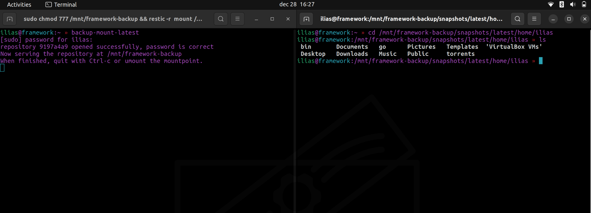

# Restic Systemd Files

This repository contains configurations files I use to backup my home directory with [Restic](https://github.com/restic/restic) to a remote server over SFTP. Backups are made every hour.

The systemd unit file and a systemd timer should be placed in _/etc/systemd/use_

* restic-backup.service
* restic-backup.timer


The restic configuration, exclude and password file should be placed in _$HOME/.config_

* restic-backup.conf
* restic-exclude.txt
* restic-password.txt

## Usage

- Create user _restic_ on your server and make sure you can login seamlessly with a SSH Key.
- Install [Restic](https://github.com/restic/restic).
- Create a restic repository on your server. 

        restic -r sftp:REMOTE-SERVER.com:/home/restic backup init

- Save the password in _$HOME/.config/restic-password.txt_.
- Add files and directories you want to ignore isn _$HOME/.config/restic-exclude.txt_.
- Reload systemd.   
        
        systemctl --user daemon-reload


## ZshRC/BashRC alias

I have created two aliases in my zshrc file to make browsing the backups easier.

* _backup-snapshots_ - lists the restic snapshots.
* _backup-mount_ - mounts the snapshots in /mnt/restic-backup.

```
alias backup-snapshots='restic -r sftp:REMOTE-SERVER.COM:/home/restic/backup snapshots --password-file=/home/USER/.config/restic-password.txt'

alias backup-mount='sudo chmod 777 /mnt/framework-backup && restic -r sftp:REMOTE-SERVER.COM:/home/restic/backup mount /mnt/restic-backup --password-file=/home/USER/.config/resticpassword.txt'
```





